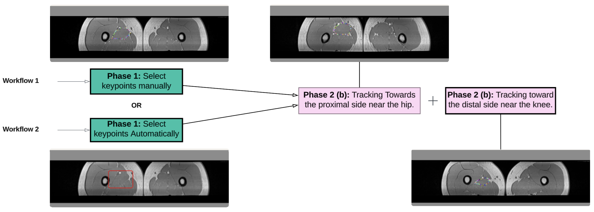


<html>
<table style="width:100%;border:0px;border-spacing:0px;border-collapse:separate;margin-right:auto;margin-left:auto;font-size:90%;">
          <tr onmouseout="nightsight_stop()" onmouseover="nightsight_start()">
            <td style="padding:20px;width:25%;vertical-align:middle;border-left-style:none;border-bottom-style:none;border-top-style:none;border-right-style:none">
              
            </td>
            <td style="padding:20px;width:75%;vertical-align:middle;border-left-style:none;border-bottom-style:none;border-top-style:none;border-right-style:none">
                <papertitle><strong>An Efficient Approach for Muscle Segmentation and 3D Reconstruction Using Keypoint Tracking in MRI Scan</strong>
                </papertitle>
               
                <strong>M. Liu</strong>, J. Lee
               
              <em>2025 ASEE Annual Conference.</em> 
              
               <a href="https://arxiv.org/pdf/2507.08690">[arXiv]</a>
              <a href="https://github.com/liumengyuan1997/muscle-tracking">[GitHub]</a>
              
            </td>
          </tr>
    </table>
    <table style="width:100%;border:0px;border-spacing:0px;border-collapse:separate;margin-right:auto;margin-left:auto;font-size:90%;">
          <tr onmouseout="nightsight_stop()" onmouseover="nightsight_start()">
            <td style="padding:20px;width:25%;vertical-align:middle;border-left-style:none;border-bottom-style:none;border-top-style:none;border-right-style:none">
              
            </td>
            <td style="padding:20px;width:75%;vertical-align:middle;border-left-style:none;border-bottom-style:none;border-top-style:none;border-right-style:none">
                <papertitle><strong>Performance Analysis of Deep Learning Models for Femur Segmentation in MRI Scan</strong>
                </papertitle>
               
                <strong>M. Liu</strong>, Y. Chen, A. Tian, X. Wu, M. Shen, T. Gong, J. Lee
               
              <em>2025 IEEE Conference on Artificial Intelligence (CAI 2025).</em> 
              
               <a href="https://arxiv.org/pdf/2504.04066">[arXiv]</a>
              
            </td>
          </tr>
    </table>
    <table style="width:100%;border:0px;border-spacing:0px;border-collapse:separate;margin-right:auto;margin-left:auto;font-size:90%;">
          <tr onmouseout="nightsight_stop()" onmouseover="nightsight_start()">
            <td style="padding:20px;width:25%;vertical-align:middle;border-left-style:none;border-bottom-style:none;border-top-style:none;border-right-style:none">
              
            </td>
            <td style="padding:20px;width:75%;vertical-align:middle;border-left-style:none;border-bottom-style:none;border-top-style:none;border-right-style:none">
                <papertitle><strong>MedVis Suite: A Framework for MRI Visualization and U-Net-Based Bone Segmentation with In-Depth Evaluation</strong>
                </papertitle>
               
                <strong>M. Liu</strong>, D. Zhang, Y. Chen, T. Gong, H. Kainz, S. Song, J. Lee
               
              <em>2025 15th International Conference on Bioscience, Biochemistry and Bioinformatics (ICBBB 2025).</em> 
              
               <a href="https://www.bio-conferences.org/articles/bioconf/pdf/2025/14/bioconf_icbbb2025_04001.pdf">[Paper]</a>
              <a href="https://github.com/liumengyuan1997/Med_Unet">[GitHub]</a>
              
            </td>
          </tr>
    </table>
    <table style="width:100%;border:0px;border-spacing:0px;border-collapse:separate;margin-right:auto;margin-left:auto;font-size:90%;">
          <tr onmouseout="nightsight_stop()" onmouseover="nightsight_start()">
            <td style="padding:20px;width:25%;vertical-align:middle;border-left-style:none;border-bottom-style:none;border-top-style:none;border-right-style:none">
              
            </td>
            <td style="padding:20px;width:75%;vertical-align:middle;border-left-style:none;border-bottom-style:none;border-top-style:none;border-right-style:none">
                <papertitle><strong>NeRF-VIO: Map-Based Visual-Inertial Odometry with Initialization Leveraging Neural Radiance Fields</strong>
                </papertitle>
               
                Y. Zhang, D. Wang, J. Xu, <strong>M. Liu</strong>, P. Zhu, and W. Ren
               
              <em>2025 IEEE 21st International Conference on Automation Science and Engineering (CASE 2025).</em> 
              
              <a href="https://arxiv.org/pdf/2503.07952.pdf">[arXiv]</a>
              <a href="https://www.youtube.com/watch?v=MhzMGQR_3-U">[Video]</a>
              
            </td>
          </tr>
    </table>
</html>

<!-- **Social Capital and the COVID-19 Pandemic**  
 **Authors:** Courtney Page-Tan, Summer Marion, Daniel Aldrich, Dylan Holck, Mengyuan Liu, Lisbeth Pimentel, Priyanka Shejwal
 **Publisher:** Natural Hazards Center, University of Colorado Boulder  
 [Link to paper](https://hazards.colorado.edu/quick-response-report/social-capital-and-the-covid-19-pandemic) -->
